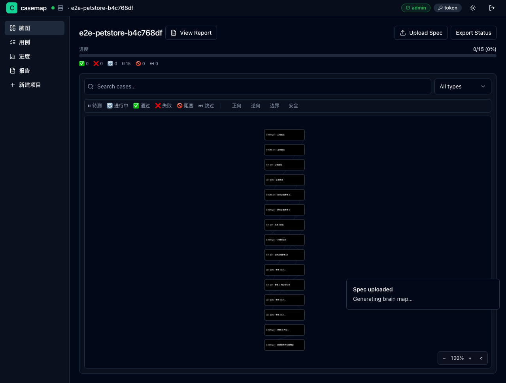
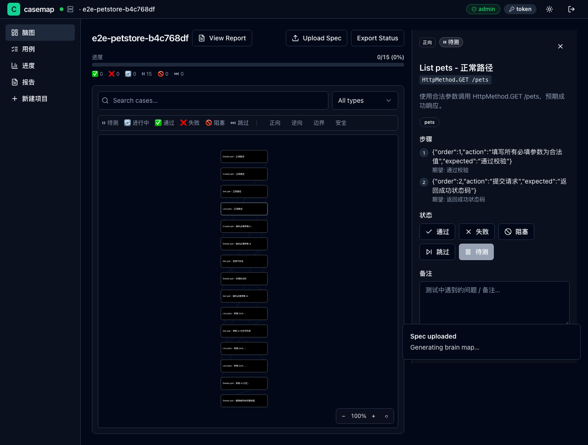
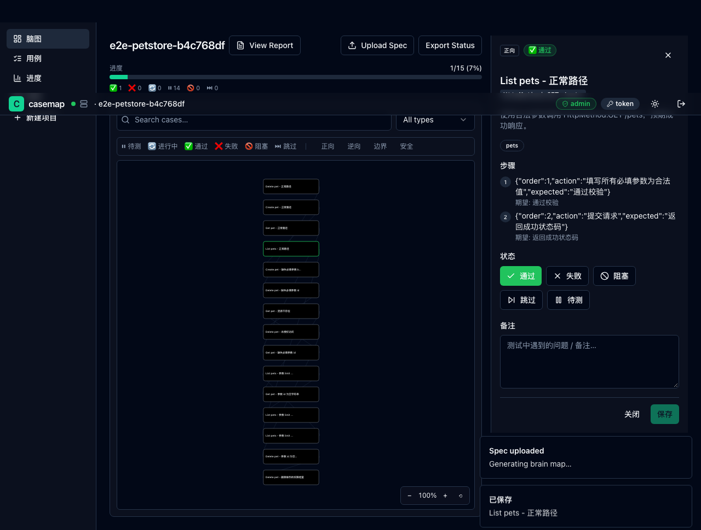

# 离线模式快速上手

> 适用：单个测试人员，独立测试一个项目，不需要团队协作。

离线模式是 casemap 最简单的使用方式：**开发给你一个 `.html` 文件，你用浏览器打开就能开始测**。不需要安装任何东西，不需要服务器，不需要懂代码。

---

## 你准备好了吗？

在开始前，请确认你已经有了以下东西：

- [ ] 一个 `.html` 文件（开发会通过邮件、IM 或者共享盘发给你，文件名通常叫 `cases.html` 或 `项目名-用例.html`）
- [ ] 一台能上网的电脑（其实离线也行 — `.html` 文件在本地就能跑，不需要联网）
- [ ] 一个现代浏览器（Chrome / Edge / Safari / Firefox 都行，推荐 Chrome）

**不需要的东西**（避免常见误解）：

- ❌ 不需要装 Python、不需要装 Node.js、不需要命令行
- ❌ 不需要注册账号、不需要联网
- ❌ 不需要懂「接口」「API」是什么技术 — 跟着本文档一步步点就行

---

## 操作步骤

### 第 1 步：拿到 `.html` 文件

开发会通过下面任一方式发给你：

1. **邮件附件** — 保存到桌面或下载文件夹
2. **共享盘 / 网盘链接** — 下载到本地
3. **企业微信 / 钉钉文件** — 点击下载

如果开发问「文件哪去了 / 怎么打不开」，请确认：

- 文件后缀是 `.html`（不是 `.htm.txt` 之类的）
- 文件大小至少几 KB（如果只有几百字节，说明下载失败）

<!-- TODO: screenshot of file in Downloads folder (OS 截图，需在用户机器上捕获) -->

### 第 2 步：用浏览器打开文件

**Windows 用户：** 双击文件，或者右键 → 「打开方式」→ 选 Chrome / Edge。

**Mac 用户：** 双击文件，或者右键 → 「打开方式」→ 选 Chrome / Safari。

**Linux 用户：** 双击文件，或者在终端里运行 `xdg-open 文件名.html`。

打开后你会看到一张五颜六色的「脑图」 — 这就是 casemap 的核心界面。



### 第 3 步：认识脑图界面

打开脑图后，页面从左到右大致分为 4 块：

```
┌──────────────────────────────────────────────────────┐
│ 顶部工具栏：项目名、进度条、导入、导出              │
├──────────┬─────────────────────────────┬──────────────┤
│          │                             │              │
│  左侧栏  │       中间脑图              │   右侧详情    │
│  节点    │     （每个方块是一个         │   （点击节    │
│  列表    │      测试用例）             │    点后显示   │
│          │                             │    在这里）   │
│          │                             │              │
└──────────┴─────────────────────────────┴──────────────┘
```

- **顶部进度条**：显示已测 / 总数。例如「12 / 80」代表 80 条用例你已经测了 12 条。
- **左侧列表**：所有用例的清单，可以搜索、过滤。
- **中间脑图**：可视化展示 — 每个方块是一个用例，方块之间的箭头表示「这个用例依赖那个用例」或「这是同一个接口的不同测试角度」。
- **右侧详情**：点击任一节点后，这里显示这条用例的完整描述、测试步骤、当前状态、备注框。

### 第 4 步：点一个节点看具体内容

脑图上每个彩色方块就是一个测试用例。用鼠标点击任意一个节点：

1. **节点被选中**（边框变粗 / 高亮）
2. **右侧详情区** 出现这条用例的：
   - **用例标题**：「用户能在不传用户名的情况下注册」之类的中文短句
   - **用例类型**（图标颜色）：正向（绿色）/ 逆向（橙色）/ 边界（蓝色）/ 安全（红色）
   - **测试步骤**：1. 打开注册页 2. 不填用户名…
   - **预期结果**：每一步应该看到什么
3. **右侧底部有 4 个按钮**：✅ 通过 / ❌ 失败 / ⏸ 跳过 / ↩ 重置



### 第 5 步：标记状态

按下面的意思选：

- **✅ 通过（绿色）** — 你按步骤测了一遍，结果跟「预期」完全一致
- **❌ 失败（红色）** — 实际结果跟预期不一样 → 一定记得在「失败备注」框写清楚「实际看到的是什么」
- **⏸ 跳过（黄色）** — 这个用例暂时没法测（比如需要另一个环境的账号）
- **↩ 重置（灰色）** — 不小心标错了，取消标记，回到「未测」

**标记后会发生什么：**

- 这个节点的颜色会变（通过=绿，失败=红…）
- 顶部进度条的「已测」数字 +1
- 脑图上相关的「汇总节点」（比如一个接口有 5 条子用例）的颜色会跟着更新



### 第 6 步：写失败备注（很重要！）

如果某个用例标了「失败」，**一定要在备注框写清楚**「实际看到的是什么」：

```
预期：返回 401 未授权
实际：返回 200，但 body 里没有用户信息（空对象）
```

或者更简单：

```
没登录直接调用，返回了用户列表 → 安全漏洞
```

为什么重要？开发拿到报告只看备注 — 他不会自己再测一遍。备注写得好，他就知道改哪里。

### 第 7 步：导出报告给开发

测完（或测到一个阶段）后，把报告发给开发：

1. 点页面右上角的 **「导出报告」** 按钮
2. 浏览器会下载一个 `.html` 文件（文件名类似 `report-项目名.html`）
3. 把这个文件发给开发 — 邮件、IM 附件都行

**这个报告是只读的**：开发打开只能看，不能改你的状态。报告里包含：

- 顶部统计：总数、通过数、失败数、通过率
- 失败用例清单 + 你的备注
- 每个接口的覆盖情况

<!-- TODO: screenshot of exported report (报告页/HTML 下载是单独流程) -->

---

## 常见错误 & 解决方法

### ❌ 错误 1：双击 `.html` 文件后，浏览器打开了源代码

**症状**：看到一堆代码，不是脑图。

**原因**：文件关联错了 — 默认打开方式是文本编辑器（如 VS Code、记事本）。

**解决方法**：

1. 右键点击文件
2. 选择「打开方式」→ 选 Chrome / Edge / Safari
3. 如果列表里没有浏览器，选「其他应用」→ 在电脑上找浏览器

---

### ❌ 错误 2：状态没保存 — 关浏览器再打开全没了

**症状**：辛辛苦苦标了 20 条「通过」，关掉浏览器第二天全没了。

**原因**：casemap 离线模式存在浏览器本地，关掉浏览器前**没导出备份**。

**解决方法**：

1. **预防**：每测完一个阶段，点「导出」按钮，把状态 JSON 文件保存到网盘 / 邮箱
2. **补救**：很遗憾，已经没了。下次记得边测边导出。
3. **终极方案**：如果你的工作很重要（不能丢），请让开发部署服务器版（团队模式） — 自动保存。

---

### ❌ 错误 3：节点点击没反应

**症状**：鼠标点节点，右侧详情不出来。

**原因**：可能是以下之一

- 鼠标点在节点边框上（要点在节点内部）
- 浏览器缩放比例不对（Ctrl + 0 重置缩放）
- `.html` 文件下载不完整（重新让开发发一次）

**解决方法**：

1. 确认鼠标点在节点方块中央
2. 按 **Ctrl + 0**（Mac 是 **Cmd + 0**）重置浏览器缩放
4. 如果还不行，重新下载 `.html` 文件

---

### ❌ 错误 4：脑图上节点太多，找不到想测的那条

**症状**：脑图密密麻麻几十上百个节点，找不到目标。

**解决方法**（按推荐顺序）：

1. **左侧搜索框**：输入关键词（接口路径 / 用例名 / 标签）
2. **左侧筛选**：只看「未测」/ 「失败」/ 「某个标签」
3. **滚轮缩放**：放大缩小找
4. **脑图右侧缩略图**：右下角小地图，点击跳转
5. **切换到「表格」模式**：以列表方式看，更紧凑

---

### ❌ 错误 5：导出报告是英文，开发看不懂

**症状**：报告里全是英文。

**原因**：casemap 默认会把英文接口描述自动翻译成中文 — 但需要开启 LLM 功能（开发给你文件时已经处理过）。

**解决方法**：

- 大部分情况下，casemap 已经把用例标题、预期结果翻译成中文了。如果全是英文，说明翻译失败或被关闭。
- 让开发重新生成一次，并告诉他「需要开启中文翻译」。

---

## 下一步

测完了？想跟同事协作？

- → [团队模式快速上手](./quickstart-team.md)：部署服务器，邀请同事一起测
- → [QA 测试人员工作流](./tester-workflow.md)：脑图和状态颜色的完整解读
- → [术语表](./glossary.md)：脑图、节点、状态这些词到底什么意思