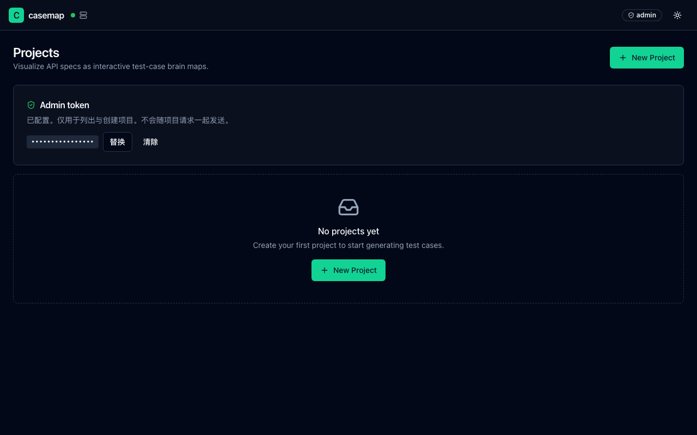
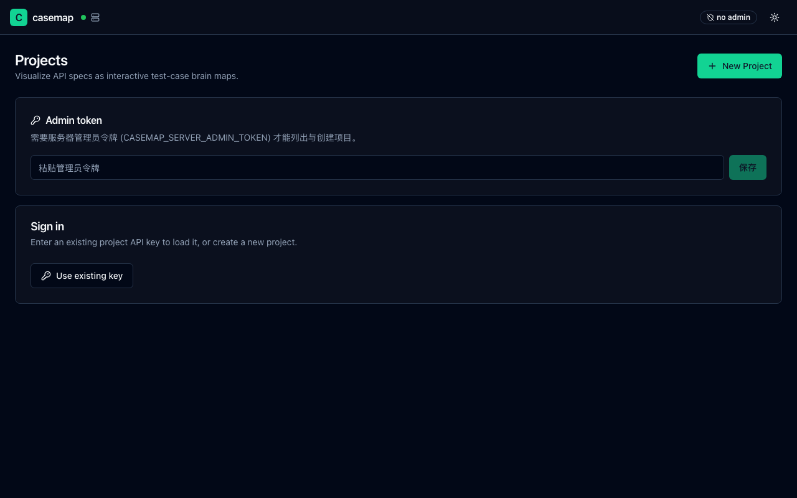
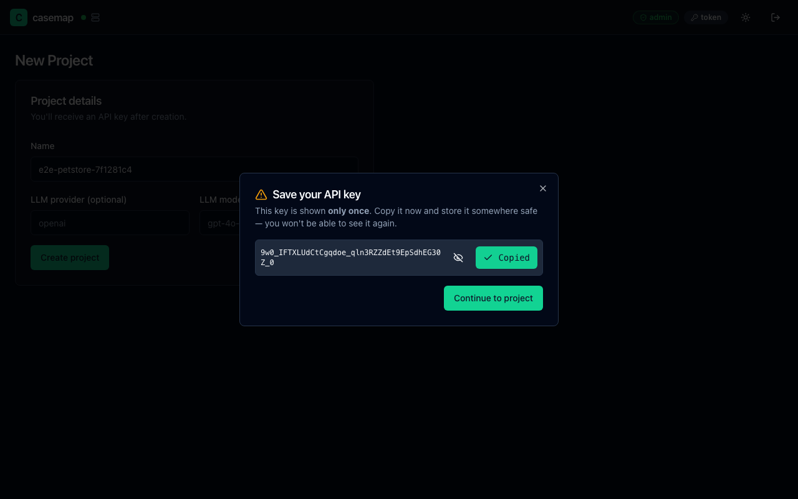
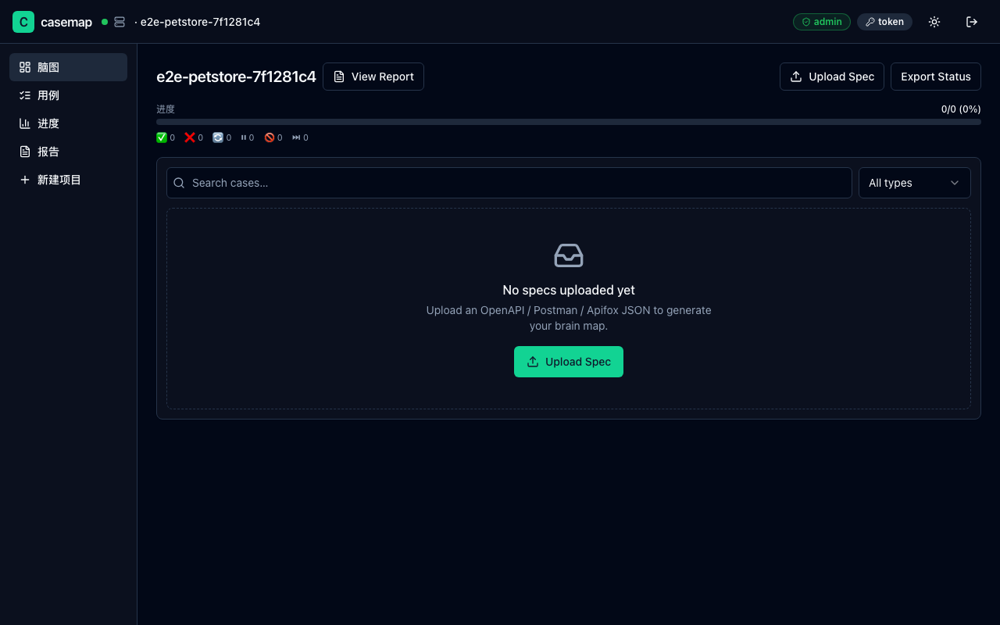
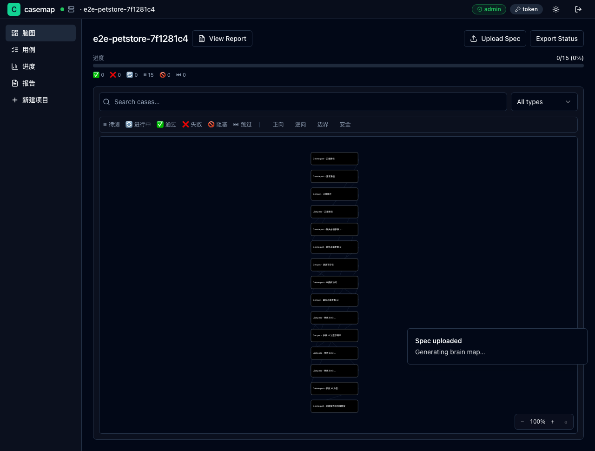

# 团队模式快速上手

> 适用：QA + PM + 业务方协作，实时同步测试进度，老板要看数据看板。

团队模式 = 一台服务器 + 一个浏览器界面。所有人的测试状态存在同一台服务器上，自动同步，谁标了什么所有人都能 1 秒内看到。

---

## 你准备好了吗？

团队模式分两步：

### 第一步：IT / 开发同事部署服务器（一次性）

**如果你不是 IT/开发**：把本指南的链接发给开发或 IT 同事，请他完成第一步后告诉你服务器地址（通常是 `http://casemap.公司域名.com`）。

**如果你是开发/IT**，往下看「服务器部署」。

### 第二步：所有人用浏览器访问

服务器启动后，所有人只需要：

- 知道服务器地址（例如 `http://casemap.company.com`）
- 一个浏览器（Chrome / Edge / Safari / Firefox 都行）
- 拿到 **项目链接**（PM 邀请时会发给你）

**完全不需要**：装 Python、装 Node.js、懂命令行 — 这些都是开发的事。

---

## 第一步（开发/IT）：部署服务器

### 方案 A：Docker 部署（推荐 — 最简单）

公司任何一台 Linux 服务器上运行：

```bash
docker run -d \
  --name casemap \
  --restart unless-stopped \
  -p 8765:8765 \
  -v casemap-data:/data \
  casemap:1.0.0
```

启动后访问 `http://服务器IP:8765` 就能看到 casemap。

**验证是否成功：**

```bash
curl http://localhost:8765/health
# 应该返回 {"status":"ok"}
```

### 方案 B：Docker Compose（推荐给正式环境）

把 `docker-compose.yml` 放到服务器某目录（项目仓库根目录就有），然后：

```bash
docker compose up -d
```

服务器自己会拉镜像、起健康检查、管理数据持久化。

### 方案 C：Python 直接运行（开发自己电脑上的临时测试用）

```bash
# 1. 装依赖（首次）
uv sync

# 2. 必填：设置管理员令牌（前端首次访问需要输入它才能列项目）
export CASEMAP_SERVER_ADMIN_TOKEN="$(openssl rand -hex 16)"

# 3. 启动（127.0.0.1 只本机访问；要给团队访问用 0.0.0.0）
uv run casemap ui --host 0.0.0.0 --port 8765 --db ./casemap.db
```

访问 `http://localhost:8765`。

> **小提示**：`casemap ui` 是 `casemap serve` 的友好别名，两个完全等价。还有 `casemap start` 也可以启动服务器。第一次部署想图省事，可以直接跑 `casemap init` 走交互式向导（会自动生成令牌 + 写一个本地 HTML 帮你存到浏览器 localStorage + 后台拉起服务器）。

### 给 PM 的服务器地址

部署完成后，把这个地址告诉 PM：

```
http://你的服务器IP:8765
```

如果服务器在云上（如阿里云），确保防火墙 8765 端口开放；如果在内网，确保公司内网能访问。

---

## 第一步半：所有人必做 — 输入管理员令牌

> ⚠️ **这一步是必须的，否则你看不到任何项目也不能创建。** casemap v1.1+ 起，列出/创建项目属于「管理员操作」，需要管理员令牌。

### 什么是管理员令牌？

- 是一串你自己设的字符串（部署时决定，比如 `export CASEMAP_SERVER_ADMIN_TOKEN=随便一段你自己定的密码`）
- 服务器启动时从环境变量 `CASEMAP_SERVER_ADMIN_TOKEN` 读取；没有它，所有管理类接口都返回 403
- 跟 **项目密钥（API Key）** 是两回事 — 项目密钥是「每个项目自己的钥匙」，管理员令牌是「整栋楼的钥匙」

详见 [术语表 - 管理员令牌](./glossary.md#admin-token管理员令牌)。

### 浏览器怎么输入？

1. 打开 `http://服务器IP:8765`
2. 页面**顶部**有一个输入框（红色徽标：「no admin」）
3. 把部署时设置的 `CASEMAP_SERVER_ADMIN_TOKEN` 粘贴进去
4. 按 **Enter**

**成功后：**

- 顶部输入框的红色「no admin」徽标 → 变成绿色的「admin」
- 下方项目列表正常加载出来
- 右上角 **「New Project」** 按钮变可用



### 嫌每次打开都要输入？让 `casemap init` 帮你存

如果你不想每次打开浏览器都粘贴一遍，部署时跑一次 `casemap init` 向导：

```bash
uv run casemap init
# 1. 提示输入 admin token → 粘贴
# 2. 提示是否启动服务器 → yes
# 3. 提示是否打开浏览器 → yes
# 4. 向导生成一个本地 HTML，浏览器打开它一次就把 token 写进 localStorage（key: casemap.admin_token）
# 5. 之后每次访问 casemap 都不用再输
```

或者手动：

```bash
# 生成一个临时 HTML，打开它一次就能把 token 写进 localStorage
uv run casemap --help
```

---

## 第二步（PM）：创建项目

PM（项目负责人）登录后做的第一件事：

### 步骤 1：打开浏览器访问服务器

地址栏输入 PM 给你的 `http://服务器IP:8765`，回车。**先在顶部输入框粘贴管理员令牌并按 Enter**（见上一步）。

你应该看到 casemap 首页 — 一个「Projects」列表，目前没有任何项目。



### 步骤 2：创建项目

1. 点击右上角 **「New Project」**（新建项目）按钮
2. 在弹出框里填写：
   - **Project name**：项目名（例如「订单系统」「支付 v2」）
3. 点 **「Create」**（创建）

### ⚠️ 关键一步：保存 API Key

创建成功后，页面会**只显示一次**一串类似这样的字符：

```
sk-casemap-7f3a9b2e8c1d4f5a6b7c8d9e0f1a2b3c
```

**这就是项目密钥。**

- ✅ 把它复制到一个安全的地方（密码管理器 / 公司文档 / 加密笔记）
- ✅ 截图保存也行
- ❌ **不要关掉这个弹窗再问"刚才那串字符呢" — 它不会再次显示**
- ❌ **不要发到公开群 / 朋友圈**



**这串密钥的用途：**

- 测试人员访问这个项目时需要它
- 开发调用 CI 自动上报时需要它
- 任何人想读写这个项目都需要它

> 类比：这串字符就像你家的门钥匙 — 谁拿到谁就能进门。所以只发给需要的人。

### 步骤 3：上传接口列表

拿到密钥后，进入项目：

1. 点 **「Upload Spec」**（上传接口文档）
2. 选择你的接口文档文件（`.json` 后缀 — OpenAPI / Swagger / Postman / Apifox）
3. 等 5–30 秒（看接口数量），casemap 会自动生成脑图

**上传之前项目页是空的：**



上传过程：



**上传完成后你会看到：**

- 项目里多了一个 spec（接口文档版本）
- 自动生成了一张测试用例脑图
- 上面有几十到几百个节点（每个节点 = 一个测试用例）

---

## 第三步：邀请测试人员 / PM

把下面的东西发给团队成员：

| 发给谁 | 发什么 |
|--------|--------|
| QA 测试人员 | 项目地址 + API Key |
| PM 老板 | 项目地址（他只用看，不需要改） |
| 开发 | 项目地址 + API Key（用于 CI 上报） |

**发送方式**：邮件 / 企业微信 / 钉钉 / Slack 都行，但：

- ⚠️ 不要发到公开群
- ⚠️ API Key 不要截图发到朋友圈 / 微博
- ✅ 用公司内部沟通工具直接发

**接收方拿到后做什么：**

1. 打开浏览器
2. 访问 `http://服务器IP:8765`
3. **首页顶部输入框**粘贴「管理员令牌」→ 按 Enter（看到顶部红色「no admin」变成绿色「admin」）
4. 进入项目 → 直接在脑图上点节点、标状态 — 项目 API Key 已经在 URL 里带上，不需要单独输入


---

## 第四步：实时同步演示

这一步是团队模式的精髓 — **多人协作，1 秒内看到对方的改动**。

### 演示步骤：

1. **PM 准备两个浏览器窗口**（比如 Chrome 和 Edge，或者 Chrome 普通窗口 + 无痕窗口）
2. **窗口 A**：用 QA 的密钥进入项目脑图
4. **窗口 B**：用 PM 的密钥进入**同一个项目**（如果有第二个密钥）
5. 在窗口 A 里点任意一个脑图节点 → 标记 **「通过」**
6. 切到窗口 B → **不要刷新**！看 1 秒内这个节点会不会自动变绿

> 💡 试一下：两个窗口并排放，QA 标记一个用例 — PM 那边 1 秒内变绿，不需要任何额外操作。

**这意味着什么：**

- 测试 A 在工位上标「失败」，PM 在会议室打开看板能立刻看到
- 测试 A 和 测试 B 不会撞车 — 每个人看自己的改动 + 实时看到队友的
- 不存在「导出版本 vs 最新版本」的问题 — 大家看的是同一份实时数据

### 离线状态怎么办？

如果你的网络断了：

- 你还能继续标状态（暂时存在本地）
- 网络一回来自动同步到服务器
- 看不到队友的新改动（直到重连）

**重连机制**：casemap 会自动重连（每秒试一次，逐步减慢），不需要你做任何事。

---

## 第五步：PM 查看进度页面

PM 老板最爱的页面 — 「进度」：

### 如何进入

1. 在脑图页面，左侧导航栏点 **「Progress」**（进度）
2. 看到一张漂亮的统计面板


### 数字怎么看

```
总计: 245 条
  ├─ ✅ 通过  180  (73.5%)
  ├─ ❌ 失败   12  (4.9%)
  ├─ 🔄 进行中 20  (8.2%)
  ├─ ⏸ 阻塞     5  (2.0%)
  ├─ ⏭ 跳过     8  (3.3%)
  └─ ⚪ 未测    20  (8.2%)
完成率: 73.5%
```

| 字段 | 业务含义 |
|------|---------|
| 总计 | 这个项目一共有多少条测试用例 |
| 通过 / 失败 / 阻塞 / 跳过 / 未测 | 各自的数量 + 占比 |
| 完成率 | 通过数 / 总数 — 通常用这个汇报老板 |

**老板问「测试进度怎么样」时：**

> 「目前完成率 73.5%，还有 12 条失败、5 条阻塞，预计 3 天内可以结束。」

### 饼图怎么看

饼图上每个色块的大小 = 该状态的占比。颜色和脑图节点颜色一致（绿=通过，红=失败…）。

### 标签维度

进度页还有按「标签」（tag）切分的横条 — 例如按接口路径分（`/login`、`/order`、`/pay`），看每个模块的完成率。

> 📊 每个 tag 一个横条，颜色和状态色一致。一眼能看出 `/order` 还差 30% 没测、`/login` 已经 100%。

---

## 第六步：导出报告给开发

测完一个阶段后，把报告给开发：

1. 在脑图页面 / 进度页面，点 **「Report」**（报告）链接
2. 或者直接浏览器地址输入 `/projects/项目ID/report`
3. 看到一张干净的报告页 — **只读，不能改状态**
4. 点 **「Print / Export PDF」**（打印 / 导出 PDF），或 **「Download Report HTML」**（下载报告 HTML）

> 💡 报告页面是单独路由 `/projects/{id}/report`，不需要管理员令牌也能访问 — 老板拿到链接直接打开看。

**报告里有什么：**

- 顶部：项目名、接口总数、通过率、生成时间
- 中间：失败用例清单 + QA 写的备注
- 底部：每个接口的覆盖情况

**怎么发给开发：**

- 把下载的 `.html` 文件当邮件附件发
- 或截图发 IM
- 或打印成 PDF

开发看到的是「真实测试结果」 — 你的备注会原样显示。**所以写备注时要专业**（不要写"我太菜了搞不定"，写"实际返回 200 但 body 缺少字段"）。

---

## 常见错误 & 解决方法

### ❌ 错误 1：「服务器连不上」

**症状**：浏览器打开 `http://服务器IP:8765` 后页面打不开 / 转圈很久。

**逐项排查：**

1. **IP 地址对吗？** — 让 IT 把准确地址再发一次（可能 IP 变了）
2. **端口对吗？** — 默认是 `8765`，有些公司在前面套了 Nginx，用 `80` 或 `443`
3. **服务器在跑吗？** — IT 在服务器上跑 `docker ps` 看 casemap 容器是否在运行
4. **防火墙开了吗？** — 公司防火墙可能拦了端口，让 IT 加白名单
5. **公司网络能访问吗？** — 如果服务器在阿里云/腾讯云，需要公网 IP

→ 详细排查：[故障排查 - 服务器连不上](./troubleshooting.md#服务器连不上)

### ❌ 错误 2：「API Key 输入后没反应」

**症状**：在首页输入 API Key 点登录，提示错误或一直转圈。

**逐项排查：**

1. **复制时少字符了？** — API Key 是 40+ 字符的长串，复制时小心空格
2. **服务器在运行吗？** — 见错误 1
3. **浏览器缓存问题？** — 换无痕窗口试一下

### ❌ 错误 3：「上传接口文档后没有反应」

**症状**：上传 spec 文件后页面一直转圈 / 报错。

**排查：**

1. **文件是 JSON 吗？** — 必须 `.json` 后缀，是 OpenAPI / Swagger / Postman 格式
2. **文件太大？** — 一般 spec 几十到几百 KB 都正常；如果上 MB 可能需要让开发精简
3. **权限够吗？** — 你的 API Key 有写权限吗（PM 应该已经给你了）

### ❌ 错误 4：「队友那边看不到我的改动」

**症状**：你在 A 浏览器改了状态，B 浏览器没自动更新。

**排查：**

1. **两边的 API Key 是同一个项目吗？** — 复制项目链接到 B 浏览器比对
2. **网络通吗？** — A 和 B 都能连服务器吗
4. **刷新 B 浏览器** — 如果还看不到，可能是网络抖动

---

## 下一步

- 想详细了解脑图怎么用？ → [QA 测试人员工作流](./tester-workflow.md)
- 想了解 PM 怎么管理项目？ → [PM 工作流](./pm-workflow.md)
- 想知道开发怎么从 CI 自动上报？ → [开发怎么用](./dev-workflow.md)
- 出问题了？ → [故障排查](./troubleshooting.md)